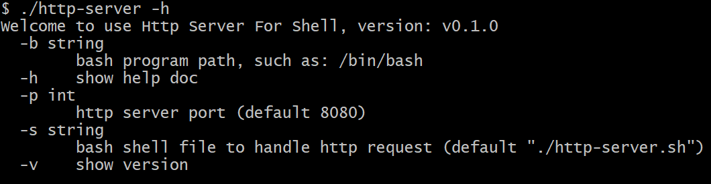
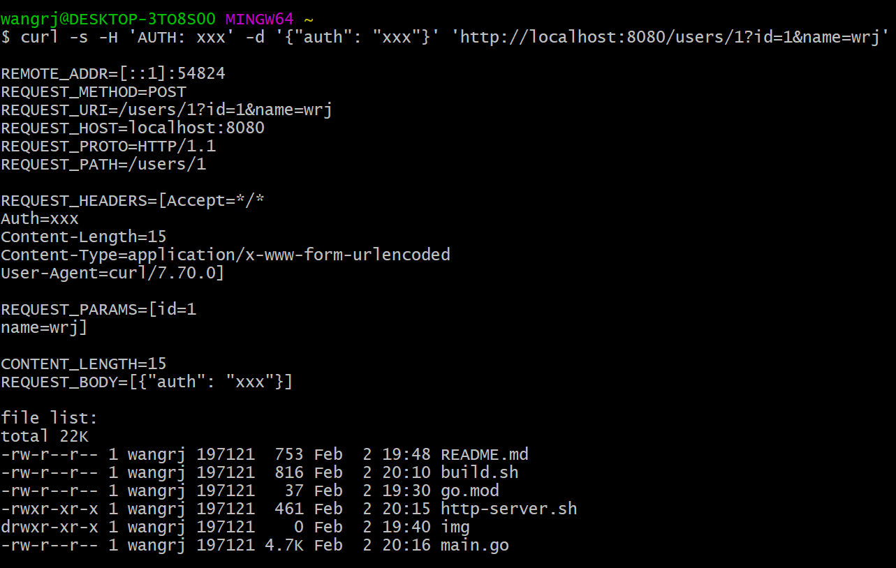

# Simple Http Server for Shell Script

Simple Http Server for Shell Script is an HTTP server based on bash shell scripts.

It is very suitable for quickly developing an HTTP service demo for those who are familiar with and passionate about bash shell.

Shell script demo: [http-server.sh](http-server.sh)

On Windows, it used `C:/Program Files/Git/bin/bash.exe`, on Linux/macOS, it used `/bin/bash`

## Usage

### command



```shell
# show version
go run main.go -v

# show help doc
go run main.go -h

# run server
go run main.go

# use another port
go run main.go -p 80

```

### request

```shell
curl -s -H 'AUTH: xxx' -d '{"auth": "xxx"}' 'http://localhost:8080/users/1?id=1&name=wrj'
```

output:


